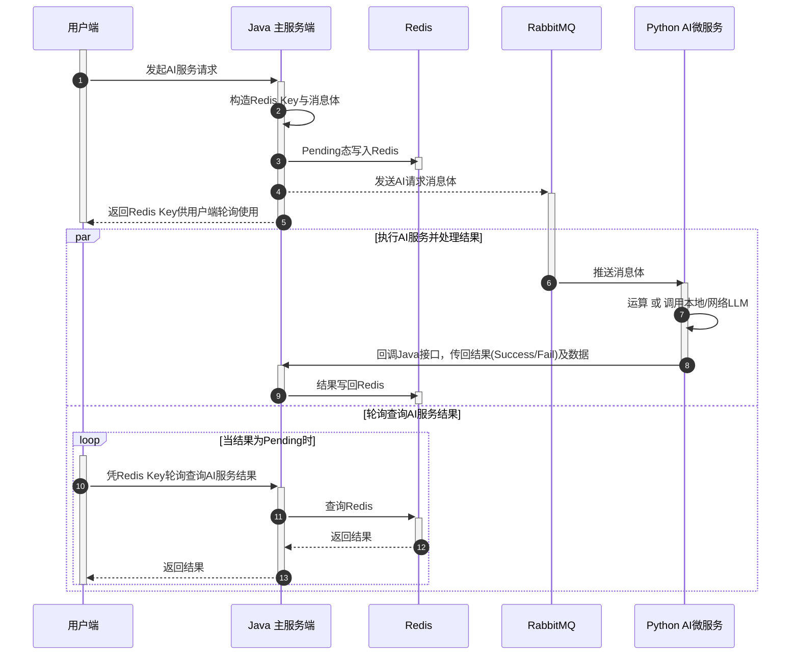

# Python AI微服务

## 1. 模块简介
该模块是Dev Pulse的AI服务部分的专用模块，目前侧重于**AI应用层面**的实现。

**实现原则**：
- Java服务端需要的最终结果是什么 (含格式、内容需求)，应直接在本模块全部做到位，不能实现或实现失败的也应如实反馈给Java端。
- 不可对MySQL、Redis等直接操作 (任何操作均不可)，应借助Java对其开放的专用**回调接口**；结果反馈也应借助回调接口。

**主要职责**：
- 接收Java的AI请求、完整Prompt拼接、tools编写、请求体构造、请求本地模型或网络LLM，结果回调Java。
- 若涉及Tool Calling，还要对结果进行反序列化、格式校验等。
- 后期若扩展工作流等，编排逻辑将于此实现。

## 2. 实现流程
针对大多数有一定耗时 (大于5秒) 的AI服务，使用如下流程完成。

- 针对同一类AI服务，Java端需为用户端提供**请求**与**轮询查询**两个接口。
- 请求接口用于构造Redis Key与消息体，并将请求消息体通过**队列**发送给Python端。
- Python端接收消息体，通过运算或调用本地/网络LLM，完成AI服务的实现，得到**最终的符合要求的结果** (或者服务失败)。
- Python端通过Java端提供的回调接口，将结果(及数据)反馈至Java端。
- Java端接收回调接口的内容并将其**写入Redis**，供用户端轮询查询。

> **除此之外，还构思过以下两类方案。**
> 
> **方案一**
>- Java仍然设计 请求 与 轮询查询 两个接口，在请求接口中，负责把请求传入队列，并将Pending态写入Redis；
>- Python端直接作为消费者接收队列消息，处理请求，并将中间状态、成功态及数据，或失败态，通过另一个响应队列写回Java端；
>- Java端直接接收响应队列的消息，并将其写入Redis，供Java端自己的轮询查询接口查询。
>- **特点**：设计了两个队列，但是只有Java可以操作Redis；不涉及Java与py的http交互。
>
> **方案二**
>- Java仍然设计请求与轮询查询两个接口，Java的请求接口把AI请求消息推向队列，并写Pending态至Redis；
>- Python端接收Java端推送的消息并处理，Python端写Redis的成功态及其数据，或失败态；
>- Java的轮询查询接口直接查询Redis结果。
>- **特点**：Java和Python均可操作Redis，只有一个队列；无Java与py间的http交互。
>
> 方案一的双队列模式，在工程落地方面是最可靠的，但是复杂度和维护成本高；方案二的模式也实现了异步解耦，复杂程度略低，但是涉及到是否将Redis控制权交给Python的争议；本项目中的实现模式，本质是两方案的折中。

## 3. 交互规范
待补充
